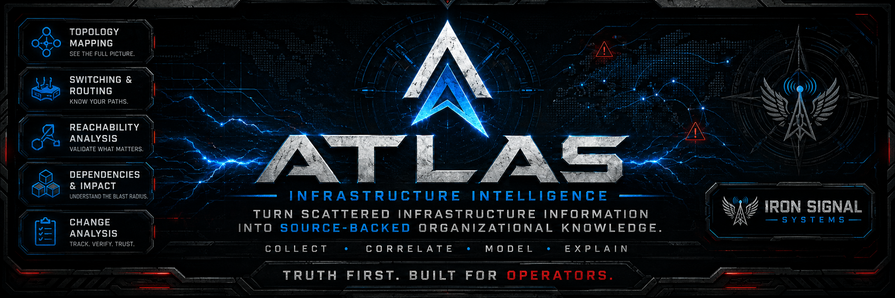

<p align="center">
  
</p>

# Atlas

**Infrastructure Intelligence by Iron Signal Systems**

> **Truth first. Built for operators.**

Atlas is a source-backed infrastructure intelligence platform designed to turn scattered infrastructure information into usable organizational knowledge.

Infrastructure teams usually already have the information they need. The problem is that the information is spread across switches, routers, firewalls, wireless systems, monitoring tools, logging platforms, security tools, identity systems, diagrams, spreadsheets, tickets, change records, vendor interfaces, and the memory of experienced engineers.

Atlas exists to correlate that information once, preserve where it came from, and answer the question without forcing the user to manually reconstruct the environment every time.

> **Do not make the user browse the network. Reconstruct the network and answer the question.**

---

## Development Status

**Pre-alpha. Not production ready.**

This repository is a clean restart of Atlas after the earlier implementation accumulated more project ceremony and process structure than the product needed.

The previous implementation is retained at [Iron-Signal-Systems/old-atlas](https://github.com/Iron-Signal-Systems/old-atlas) as historical reference.

Useful code and design work may be brought forward selectively. Nothing is migrated simply because it existed before.

The current direction is to build the simplest correct implementation that answers real infrastructure questions while preserving strong source lineage, historical integrity, least privilege, and explicit uncertainty.

A controlled pilot is targeted approximately **24–36 months** from this restart, subject to engineering and validation results.

---

## What Atlas Is

Atlas is an **infrastructure intelligence platform**.

It is intended to understand how infrastructure is actually constructed, connected, controlled, dependent, and changing.

Atlas combines approved source information from multiple systems and vendors into a source-traceable model that can support:

- infrastructure identity;
- topology reconstruction;
- switching and VLAN relationships;
- routing and path analysis;
- firewall and ACL context;
- NAT, VPN, and SD-WAN relationships;
- reachability analysis;
- dependency and blast-radius analysis;
- identity and privilege context from specialist systems;
- historical comparison;
- change-impact analysis;
- generated diagrams and living documentation;
- role-appropriate explanations; and
- governed export of useful context to external systems.

Atlas is designed to answer questions, not merely display normalized records.

---

## The Problem Atlas Solves

A senior network administrator or engineer can often answer difficult infrastructure questions manually.

The problem is the work required to get there.

One question may require logging into several devices, reading configurations, checking routing tables, tracing VLANs, reviewing firewall policies, looking at monitoring data, consulting diagrams, checking old tickets, asking another administrator what changed, and relying on memory.

Atlas is intended to compress that work.

Examples include:

- Where is this IP address?
- Which site, switch, interface, VLAN, subnet, or routing domain contains it?
- Which gateway and route are used?
- Why did that route win?
- Can source A reach destination B on protocol or port X?
- Which firewall policy, ACL, NAT rule, VPN, or SD-WAN decision affects the path?
- Is the return path valid?
- What depends on this switch, circuit, route, firewall, VLAN, tunnel, or site?
- Does the supposed redundant path actually carry everything the service requires?
- What changed before this outage began?
- What would a proposed change affect?
- What is the risk of making the change?
- What is the risk of delaying or denying it?
- What does BloodHound say about an identity path, and does the network actually support the required reachability?
- Which sources support the answer?
- What is stale, incomplete, inferred, unknown, or conflicting?

> **What takes an experienced engineer hours to reconstruct manually should, when Atlas has the necessary source information, be answerable in seconds or minutes.**

---

## A Practical Example

Assume a fiber cut takes down a camera network at a building that was believed to have a redundant path.

The physical failure may be obvious. The useful question is:

> **Why did this fiber failure take down the camera VLAN if the site was supposed to be redundant?**

The real cause may have been introduced months earlier:

- a new switch was installed;
- the alternate site path changed;
- the camera VLAN was never extended across the new path;
- the spreadsheet or diagram was not updated;
- the primary path continued working, hiding the missing dependency; and
- the problem became visible only when the fiber failed.

Atlas is intended to reconstruct that environment and explain:

- which devices and links participate;
- which VLANs traverse each link;
- which path is primary;
- whether the alternate path actually supports the affected service;
- which routes and controls participate;
- when the dependency changed;
- what other services share the same dependency; and
- which source observations support the conclusion.

The objective is not a prettier diagram.

The objective is to make hidden dependencies visible before failure and understandable immediately after failure.

---

## Core Operating Model

```text
COLLECT
   ↓
PRESERVE SOURCE IDENTITY
   ↓
NORMALIZE
   ↓
CORRELATE
   ↓
MODEL
   ↓
REASON
   ↓
ANSWER / MAP / COMPARE / EXPLAIN
```

The system may become sophisticated because infrastructure is sophisticated.

Individual components should remain understandable, bounded, testable, and replaceable.

---

## Read-Only by Design

Atlas is designed around **read-only collection and least privilege**.

The normal operating model is:

```text
read → ingest → normalize → correlate → calculate → explain → compare → recommend → export → validate
```

Atlas does not need administrative control over infrastructure simply to understand it.

Collectors should receive only the authority necessary to retrieve their approved source information.

Atlas does not silently modify infrastructure.

Any future write or provisioning capability would require a separately engineered authority boundary with explicit approval, attribution, bounded scope, least privilege, validation, and recovery behavior.

Read-only operation is not a missing feature. It is part of the trust model.

---

## Atlas Is Not a Replacement for Specialist Tools

Atlas is not intended to replace tools that already perform specialized functions well.

- **Zabbix** and similar systems remain responsible for monitoring, alerting, graphing, escalation, maintenance, and availability.
- **Graylog** and similar systems remain responsible for centralized logging, indexing, retention, and search.
- **Security Onion, CrowdStrike, and other security platforms** remain responsible for their detection, packet, endpoint, hunting, and investigation functions.
- **BloodHound** remains responsible for identity and privilege attack-graph analysis.
- **Cisco, Fortinet, and other infrastructure platforms** remain responsible for operating and enforcing infrastructure state.
- **Draw.io** and similar tools remain useful human-editable publication and documentation formats.

Atlas uses approved information from specialist systems where useful, adds infrastructure context, correlates relationships across domains, and may later publish selected context back to external tools.

> **Specialist tools remain specialists. Atlas fills the gaps between them.**

---

## Source-Backed Answers

Atlas should never present a calculated conclusion as unexplained magic.

Material answers should retain enough information to determine:

- where the source information came from;
- when it was collected or imported;
- what source content was processed;
- the cryptographic identity of that source content where applicable;
- which parser or analyzer interpreted it;
- what was directly observed;
- what was configured;
- what Atlas calculated;
- what Atlas inferred;
- what assumptions were required;
- what conflicts exist;
- what is incomplete;
- what is stale; and
- what Atlas cannot establish.

Initial state vocabulary includes:

- `CONFIGURED`
- `OBSERVED`
- `CALCULATED`
- `INFERRED`
- `UNKNOWN`
- `CONFLICTING`

A configuration proves configuration. It does not automatically prove live operational state.

A route being configured does not prove it is currently selected.

A Layer-3 path existing does not prove a firewall permits the service.

A BloodHound identity relationship existing does not prove the required network path exists.

A missing observation does not automatically prove absence.

> **If Atlas cannot establish the truth, it should report the uncertainty rather than invent certainty.**

---

## Infrastructure Model

Atlas will build its model from source-backed relationships rather than vendor navigation structures.

Expected model areas include:

### Physical and organizational placement

- organizations, sites, buildings, rooms, and racks;
- devices, chassis, stacks, logical devices, and components.

### Layer 2

- interfaces and access ports;
- VLANs and trunks;
- native and allowed VLANs;
- port channels;
- neighbors;
- MAC observations and endpoint attachment;
- spanning-tree relationships.

### Layer 3

- IP addresses and prefixes;
- subnets and gateways;
- VRFs, VDOMs, and routing domains;
- routes, next hops, and path selection.

### Controls and boundaries

- firewall zones and policies;
- ACLs;
- address and service objects;
- NAT and VIPs;
- VPN and SD-WAN;
- management-plane exposure;
- trust boundaries.

### Supporting context

- identity references;
- privilege-path references;
- wireless relationships;
- monitoring context;
- documentation;
- changes;
- source freshness;
- dependencies;
- conflicts; and
- historical observations.

Vendor-specific values remain available for traceability, but vendor syntax does not become the Atlas canonical model.

---

## Initial Source Workstreams

Source support is developed as **parallel workstreams**, not as giant vendor phases.

A source is expanded when Atlas needs additional facts to answer real questions.

### Cisco

Initial Cisco work is expected to cover useful information such as device identity, interfaces, VLANs, trunks, port channels, CDP/LLDP, spanning tree, MAC/ARP, routing, VRFs, ACL context, stacks, wireless controllers, APs, WLANs, and selected diagnostics.

Atlas does not need to parse every command Cisco exposes simply because it exists.

### FortiGate

Initial FortiGate work is expected to cover platform identity, interfaces, VLANs, zones, VDOMs, objects, firewall policies, routing, NAT, VIPs, VPNs, SD-WAN, HA context, management exposure, local-in controls, and selected runtime state.

### BloodHound

BloodHound source handling should preserve BloodHound semantics faithfully.

Atlas may ingest approved bounded BloodHound output while retaining exact source identifiers, node identity, relationship identity, relationship type, source timestamps, supported and unsupported values, unresolved endpoints, lineage, and BloodHound-owned path references where applicable.

> **BloodHound said X. Atlas stores X. Atlas does not reinterpret X during ingest.**

Correlation comes later.

### Diagrams and documentation

Draw.io and other approved documentation may be used as supporting source material.

Human-maintained documentation does not automatically override more current infrastructure observations.

---

## BloodHound and Network Correlation

BloodHound and Atlas answer different parts of a larger question.

```text
BloodHound
identity / privilege relationship
          ↓
        Atlas
asset correlation
          ↓
network placement
          ↓
routing / firewall / service reachability
          ↓
combined explanation
```

Possible outcomes include:

```text
Identity capability: YES
Network capability: YES
Result: combined path supported by available observations
```

```text
Identity capability: YES
Network capability: NO
Result: identity relationship exists, but the required network path is not currently supported
```

```text
Identity capability: UNKNOWN
Network capability: YES
Result: network path exists; identity capability cannot be established from available source information
```

Atlas should preserve the distinction instead of collapsing separate facts into one conclusion.

---

## Topology Mapping and Living Documentation

Atlas diagrams should be generated from the same model used to answer questions.

The mapping direction is expected to grow approximately in this order:

1. site topology;
2. site-to-site connectivity;
3. switch-to-switch relationships;
4. trunks and port channels;
5. VLAN propagation;
6. Layer-3 paths;
7. firewall boundaries;
8. WAN and circuit dependencies;
9. wireless infrastructure;
10. detailed switch-port and endpoint attachment.

Generated diagrams should visibly distinguish observed, calculated, inferred, stale, unknown, and conflicting relationships.

Atlas-generated diagrams are projections of the current Atlas model. They should not become another independently maintained source of truth.

---

## Dependency and Blast-Radius Analysis

Topology alone is not enough.

Atlas is intended to answer questions such as:

- What depends on this switch?
- What depends on this interface?
- What depends on this circuit?
- What depends on this VLAN?
- What depends on this route?
- What depends on this firewall policy?
- What stops working if this site disappears?
- Which services share a hidden single point of failure?
- Does an alternate path actually support the affected VLAN, route, policy, and service?

The goal is to expose relationships that may not be obvious from an individual device configuration.

---

## Historical State

Atlas is designed around additive history.

New observations do not silently erase older observations.

Corrections, superseding information, changed relationships, and later knowledge are represented as new history.

This allows Atlas to eventually answer:

- What did the network look like before this change?
- When did this dependency first appear?
- When did this VLAN stop crossing this trunk?
- Was this route present during the outage?
- What changed between two observations?
- Did the post-change environment match the intended result?

> **History is additive. New knowledge does not erase old knowledge.**

---

## Change Analysis and Decision Support

Atlas should support both the person making a technical change and the person responsible for approving it.

### Operator / engineer view

May include exact devices, interfaces, VLANs, routes, policies, dependencies, calculated paths, before/after state, validation requirements, rollback information, and supporting source observations.

### Leadership / change-authority view

May include the problem, proposed outcome, reason for change, affected services, expected disruption, dependencies, risk of approval, risk of delay or denial, rollback expectations, confidence, and known unknowns.

> **Summarize upward. Expand downward.**

Atlas should reduce both the technical effort required to understand a change and the paperwork required to explain it.

---

## Organizational Memory

Infrastructure knowledge often exists in one experienced engineer's memory, an old spreadsheet, a stale diagram, ticket comments, device descriptions, old email, and undocumented assumptions.

That works until the person who remembers the environment is unavailable.

Atlas is designed to preserve infrastructure relationships and history so another qualified operator can reconstruct the answer without requiring the original engineer to be present.

> **Atlas turns scattered infrastructure information into source-backed organizational knowledge.**

---

## External Context and Enrichment

Atlas may later exchange selected context with external systems such as Zabbix, Security Onion, CrowdStrike, Graylog, asset systems, documentation platforms, and other approved tools.

Examples may include canonical asset identity, site, switch and port, VLAN, subnet, dependency, network-path context, source freshness, and selected identity correlation.

Atlas publishes **context**, not duplicate detections.

External systems remain responsible for their existing functions.

---

## PostgreSQL and Record Integrity Direction

PostgreSQL is the planned authoritative record store.

Authoritative history is intended to be append-only to normal Atlas application and service roles. Normal roles should not receive authority to rewrite historical records through routine application operation.

A separate verification PostgreSQL instance is planned for each Atlas deployment.

That verifier is dedicated to Atlas only and exists to retain the record identities, ordering information, and cryptographic hashes necessary to verify a questioned authoritative Atlas database.

```text
                Atlas shipper
                     |
            canonical record + hash
                     |
            +--------+--------+
            |                 |
            v                 v
   Atlas PostgreSQL     Atlas Verify PostgreSQL
   full record          identity + hash
   authoritative        verification only
```

The verifier is not another application database, not an Atlas query store, and not shared with other Iron Signal Systems products.

Compromise of the PostgreSQL superuser or underlying database-host administrator exceeds the local database integrity boundary. Atlas does not claim that software entirely inside a fully compromised administrative boundary can guarantee its own historical integrity.

---

## Build Provenance Direction

ISS release builds are intended to have a cryptographic identity.

For release builds, Atlas is intended to:

- calculate the SHA-256 of the running executable;
- associate that hash with the running version;
- record the observed executable identity at startup;
- compare it with the expected release identity;
- retain the result as history; and
- publish release SHA-256 values with signed GitHub release material.

This supports both supportability and later compromise investigation.

A mismatch means the running artifact does not match the expected published build and should be investigated. A mismatch does not automatically prove compromise.

---

## Architecture Direction

Atlas should stay simple enough to reason about.

```text
Cisco -----------\
FortiGate --------\
BloodHound --------> bounded source ingestion
Diagrams ---------/            |
Other sources ----/             v
                         source-backed records
                                  |
                                  v
                              PostgreSQL
                                  |
                                  v
                             correlation
                                  |
               +------------------+------------------+
               |                  |                  |
               v                  v                  v
            topology          reachability       dependency
               |                  |                  |
               +------------------+------------------+
                                  |
                                  v
                       answer / map / compare
                                  |
                                  v
                     operator and leadership views
```

Shared abstractions should be extracted only after working implementations demonstrate a real common contract.

Atlas should not build frameworks simply because they may become useful someday.

---

## Development Principles

### Build the simplest correct thing

> **Build the simplest correct thing that answers a real Atlas question.**

Complexity is allowed when the problem requires it. Complexity must earn its place.

### Source truth before interpretation

Preserve native identifiers, values, relationships, timestamps, and source context before deriving higher-level conclusions.

### Parse faithfully first

> **Parse faithfully first. Correlate later. Derive last.**

### Unknown is a valid result

Atlas should prefer an explicit unknown over a confident but unsupported answer.

### Tests over ceremony

Engineering assurance should come primarily from tests, fuzzing, hostile-input validation, deterministic fixtures, resource bounds, failure testing, recovery exercises, security review, adversarial testing, and real-world validation.

Documentation should exist when it helps build, operate, support, secure, test, or explain the product.

Process does not substitute for correctness.

### No speculative frameworks

Do not build a generalized framework until multiple real implementations demonstrate that the abstraction is necessary.

### Git already remembers

The active project does not need to preserve obsolete roadmap numbers or process structures merely to remember that they once existed.

Git history and `old-atlas` already provide that record.

---

## Initial Development Direction

The clean Atlas restart will build capability rather than vendor-numbered phases.

1. **Core records and ingestion**
2. **Infrastructure model and correlation**
3. **Answer engine and reachability**
4. **Mapping and living documentation**
5. **Dependency, change, and role views**
6. **Read-only collection and external context**
7. **Production hardening and controlled pilot**

Cisco, FortiGate, BloodHound, diagrams, and future source systems advance as workstreams across those capabilities.

The roadmap should change when engineering reality proves that it should change.

---

## Security Principles

Atlas is expected to follow several non-negotiable security rules:

- collectors are read-only by default;
- least privilege is required;
- source collection is explicitly scoped;
- source input is treated as untrusted;
- parsers are bounded;
- operations have timeouts and resource limits;
- secrets do not belong in Git;
- raw sensitive customer source material does not belong in Git;
- historical application records are not silently rewritten;
- identity claims do not automatically become authorization;
- calculated relationships retain their assumptions;
- uncertainty remains visible;
- software build identity is verifiable;
- database integrity can be independently checked; and
- compromise of a higher administrative trust boundary is stated rather than hidden.

---

## Repository Direction

The repository is intentionally being rebuilt with a small active surface.

Expected structure:

```text
.
├── cmd/                    Executables
├── internal/               Core Atlas implementation
├── modules/                Source/vendor workstreams
│   ├── cisco/
│   ├── fortigate/
│   └── bloodhound/
├── sql/                    PostgreSQL schema and migrations
├── integrations/           External-system adapters
├── diagrams/               Diagram generation/support
├── docs/                   Necessary technical documentation
├── assets/                 Project branding and README assets
├── README.md
├── ROADMAP.md
├── SECURITY.md
├── LICENSE
└── go.mod
```

Directories should be added when implementation requires them rather than created solely to satisfy a template.

---

## Current Bootstrap State

This is a fresh repository.

Code from `old-atlas` will be reviewed and migrated selectively.

> **Nothing comes into the new Atlas merely because it existed in old Atlas. It comes across because the new Atlas needs it and the implementation still makes sense.**

Early migration priorities are expected to include useful portions of PostgreSQL foundations, source identity and history, Cisco parsing and tests, FortiGate parsing and tests, BloodHound source fidelity and persistence, bounded ingestion, source hashing and lineage, and adversarial test cases.

Working code should not be rewritten merely for the sake of rewriting it. It should be brought forward, understood, simplified where appropriate, tested, and then used.

---

## Pilot Direction

The first controlled Atlas pilot is intended for a real, authorized environment where value can be measured against how infrastructure work is performed today.

The pilot should help establish:

- whether Atlas answers are correct;
- whether uncertainty and missing information are represented truthfully;
- whether Atlas reduces troubleshooting and investigation time;
- whether hidden dependencies become visible;
- whether generated diagrams are useful and current;
- whether change understanding improves;
- whether another qualified administrator can use the system without depending on one senior engineer's memory;
- whether collection remains safe and low-impact; and
- whether the system can be recovered and its history verified.

The pilot is not intended to prove that Atlas knows everything.

It is intended to prove that Atlas can provide trustworthy, useful infrastructure intelligence from the information it has.

---

## Product Test

Every significant Atlas feature should face the same question:

> **Does this capability save a qualified operator from manually correlating multiple devices, interfaces, VLANs, routes, policies, command outputs, diagrams, identity records, monitoring screens, and documentation to reach the same conclusion?**

Progress is not measured by parser count, dashboard count, phase count, document count, or raw record volume.

Progress is measured by useful questions answered, correctness, visible uncertainty, time saved, dependencies understood, changes explained, operational burden avoided, and trust earned.

---

## Guiding Statements

> **Truth first. Built for operators.**

> **Collect. Correlate. Model. Explain.**

> **Know. Understand. Explain.**

> **Summarize upward. Expand downward.**

> **Atlas turns scattered infrastructure information into source-backed organizational knowledge.**

---

## Historical Project

The previous Atlas repository and development history are retained at:

[Iron-Signal-Systems/old-atlas](https://github.com/Iron-Signal-Systems/old-atlas)

That repository is historical reference material and does not define the structure of this clean implementation.

---

## License

No license terms are granted by this README.

The applicable license will be defined in the repository `LICENSE` file when it is added.

Copyright © Iron Signal Systems.
